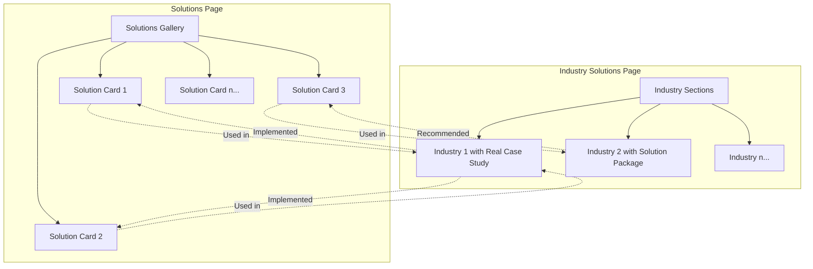

# Solutions & Industry Solutions Pages Guide

## Overview

This document outlines the structure and management process for the Solutions page and Industry Solutions page (future Results page) on the FlowMatrix AI website.

## Page Structure Diagram



## Required Information Templates

### Adding a Solution to Solutions Page

```yaml
id: "email-intelligence"
title: "Email Intelligence System"
description: "Automatically organizes and prioritizes emails, with daily summaries and action items"
category: "Email Automation"
timeMetric: "20+ hrs/week saved"
costMetric: "$4,000/month value"
videoUrl: "https://youtu.be/..."
relatedCaseStudies:
  - "construction-company"  # ID of the case study/industry solution
```

### Adding an Industry Solution

```yaml
id: "construction-company"
industryType: "Construction"
isRealCaseStudy: true  # Set to false for projected solution packages
clientName: "UBL Group"  # Optional, only for real case studies
title: "How a Construction Company Saved 50+ Hours Weekly"
overview: "Regional construction firm struggling with project coordination and communication..."
totalTimeSaved: "50+ hrs/week"  # Real metric or projected estimate
totalCostSavings: "$10,000/month"  # Real metric or projected estimate
testimonial: "FlowMatrix AI transformed our operations..."  # Only for real case studies
implementedSolutions:
  - "email-intelligence"   # ID of the solution on Solutions page
  - "project-tracker"      # ID of the solution on Solutions page
  - "invoice-automation"   # ID of the solution on Solutions page
```

## Card Templates

### Solution Card Template

```
┌──────────────────────────────────┐
│ [ICON/THUMBNAIL]                 │
│                                  │
│ Email Intelligence System        │
│                                  │
│ Automatically organizes emails,  │
│ prioritizes important messages...│
│                                  │
│ ⏱️ 20+ hrs/week saved            │
│ 💰 $4,000/month value            │
│                                  │
│ [View Details Button]            │
│                                  │
│ Used in: Construction, Real Estate│
└──────────────────────────────────┘
```

### Industry Solution Card Template

```
┌──────────────────────────────────┐
│ CONSTRUCTION INDUSTRY            │
│                                  │
│ [REAL CASE STUDY BADGE]          │
│                                  │
│ 50+ HOURS SAVED WEEKLY           │
│ $10,000/MONTH VALUE              │
│                                  │
│ Challenge: Coordinating multiple │
│ projects across 12 job sites...  │
│                                  │
│ Solutions Implemented:           │
│ • Email Intelligence System      │
│ • Project Tracker                │
│ • Invoice Automation             │
│                                  │
│ [Read Full Case Study]           │
└──────────────────────────────────┘
```

## Cross-Linking Process

When adding or updating content:

1. **Adding a New Solution**:
   - Check if any existing industry solutions use this solution
   - Add links to those industry solutions in the solution card
   - Update the relevant industry solutions to include links to this new solution

2. **Adding a New Industry Solution**:
   - For each implemented/recommended solution listed, add links to the Solutions page
   - For real case studies, use "Implemented at" language
   - For projected packages, use "Recommended for" language

## Content Type Distinction

### Real Case Study vs. Solution Package

**Real Case Study (Client-Based)**
- Badge/label clearly indicating "Client Success Story"
- Use "Implemented" and "Results" terminology
- Include specific metrics and testimonials
- Link directly to solutions that were actually used

**Solution Package (Industry-Based)**
- Badge/label indicating "Recommended Solution Package"
- Use "Projected" and "Estimated Impact" terminology
- Include industry-standard metrics as projections
- Link to solutions that are ideal for this industry

## Transition Strategy

As more clients are onboarded:

1. Add real case studies with "Client Success Story" badges
2. Gradually replace solution packages with real case studies
3. When sufficient real case studies exist (5+), rename from "Industry Solutions" to "Results" or "Case Studies"
4. Reorganize page to prioritize client success stories over solution packages
